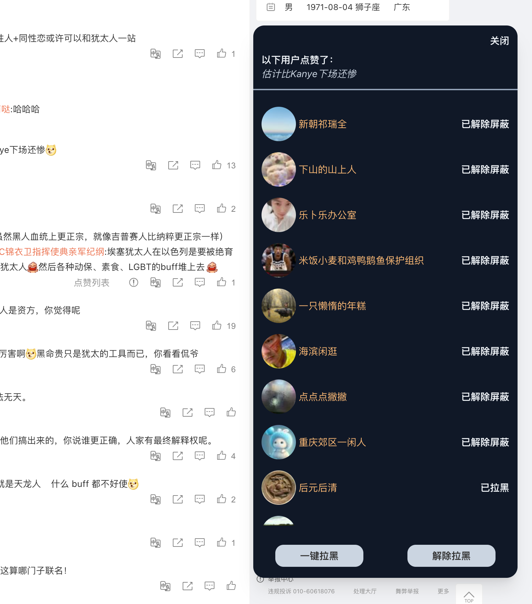
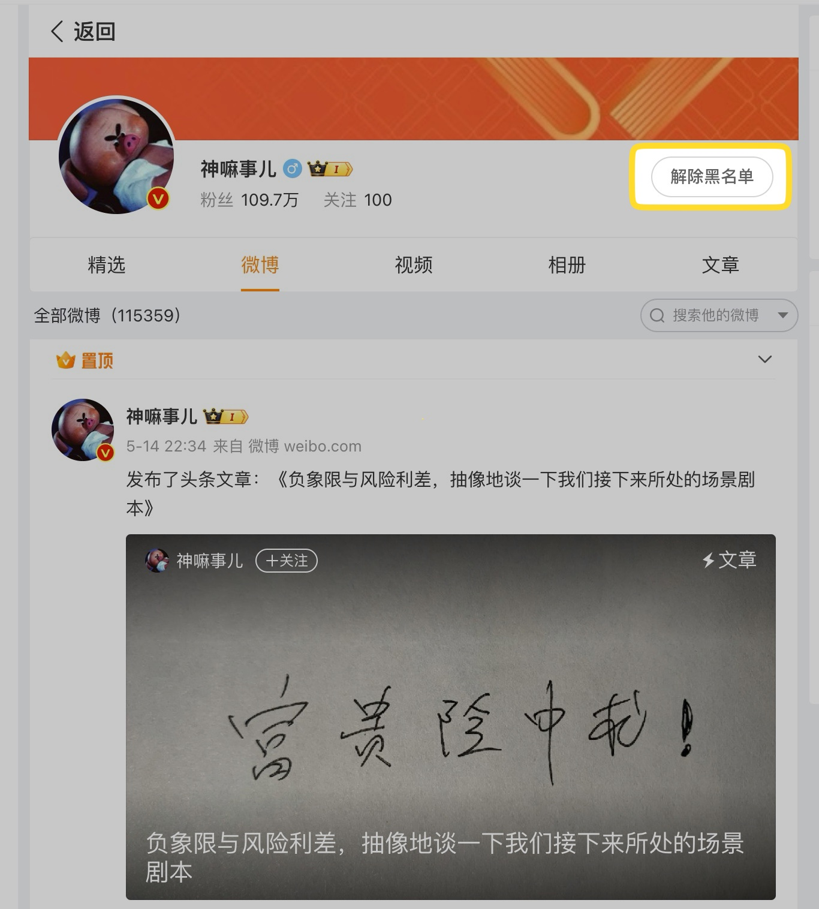
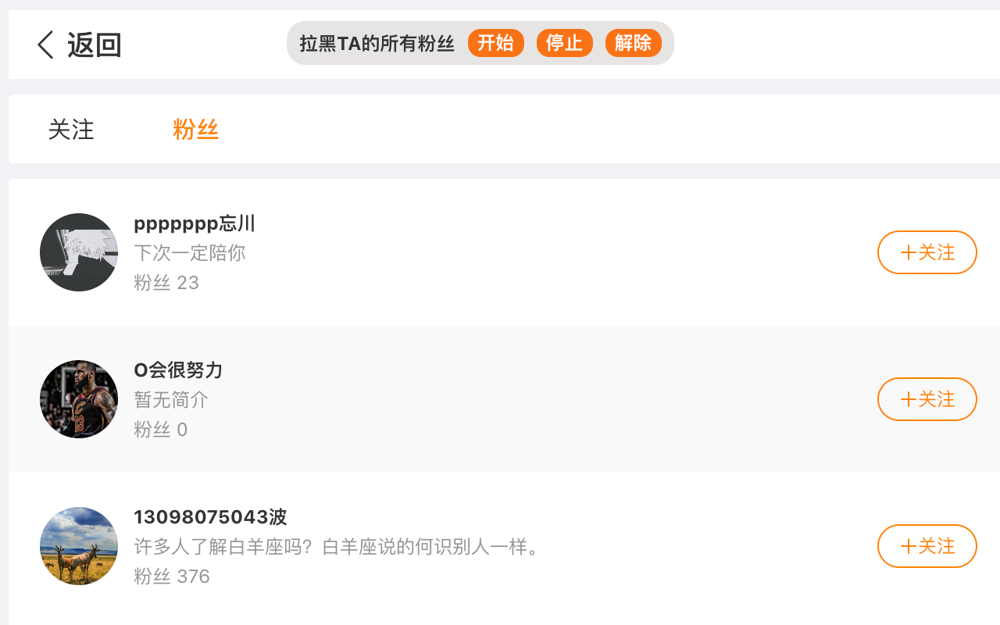
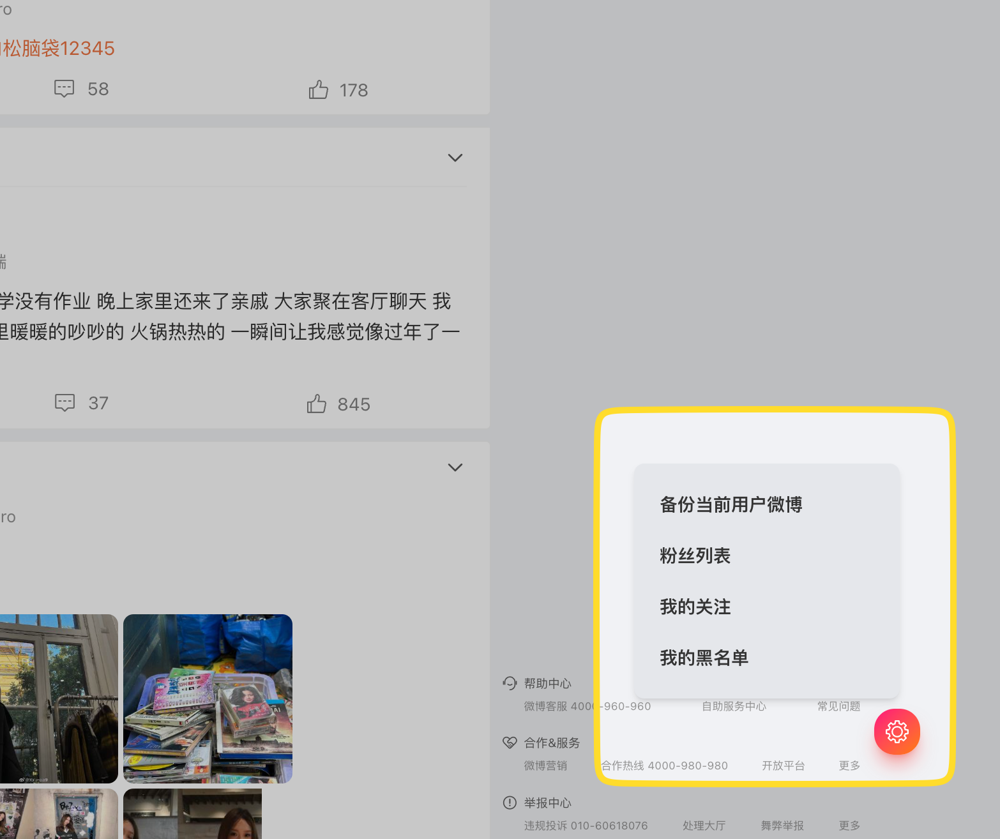
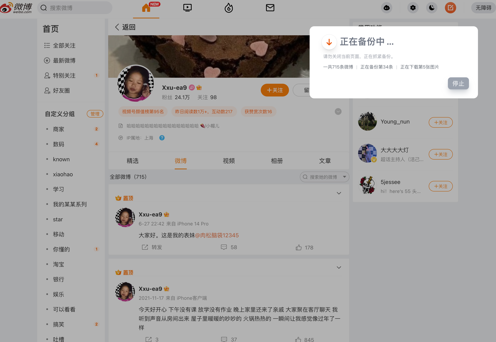
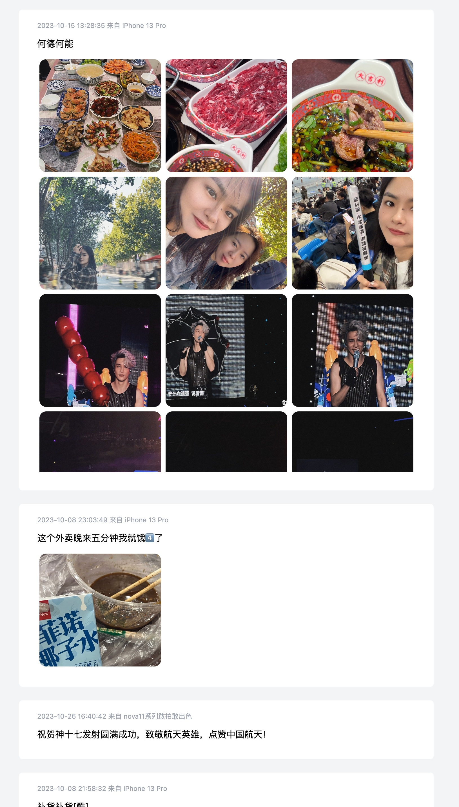

## Weibo Extend
微博扩展插件

********** 该插件仅用于学习和交流 **********

------

 

[下载及安装](#download_install)
 

[实现功能](#feats)
 

[Screenshots](#screenshots)
 

[一些说明](#remarks)
 

------

### 下载及安装
可直接在 [Release](https://github.com/loo-y/weibo-extend/releases/) 中下载最新安装包，或者前往以下商店下载： 
(商店由于需要审核，版本更新不及 Release 包)

Edge Addon👉 [微博扩展](https://microsoftedge.microsoft.com/addons/detail/kgadefmghkgpaapildhabgaindebmfdm)

Chrome Extension👉 [微博扩展](https://chrome.google.com/webstore/detail/npegohlaijfkhcjahlgddhanhimeoibn)

------

### 实现功能
1. 被对方拉黑之后，仍可查看其主页 (✔️)

2. 在拉黑某人之后，仍可查看其主页 (✔️)

3. 批量拉黑某条评论的点赞用户 (✔️)

4. 批量拉黑某条微博的点赞用户 (TODO)

5. 移除时间流中类型为广告的微博 (✔️)

6. 批量拉黑某人的所有粉丝 (✔️)

7. 支持备份自己/他人微博到本地 (✔️)

 

------

### Screenshots
**查看点赞列表**
    

**批量拉黑，批量解除拉黑**
    

**拉黑/被拉黑后仍可查看主页**
    

**批量拉黑某人的所有粉丝**
    

**悬浮球**
    

**备份微博**
    

**本地查看已备份的微博**
    

 

------

### 一些说明
1. 当前备份功能以 html 格式查看，每100条为单位存储成 zip 包，包名有具体条数说明。
2. 每个备份包内，myblog.js 为当前包的 json 数据，images 文件夹包含了这 100 条数据中的图片，默认以大图存储。
3. 备份功能目前还不支持视频以及转发的微博备份。