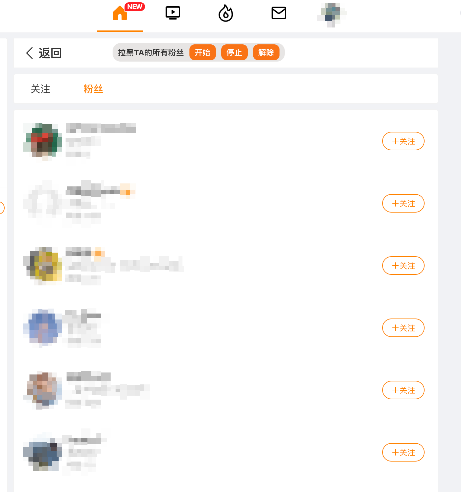

# Weibo Extend
微博扩展插件


------

<br />

[下载及安装](#download_install)
<br/>

[实现功能](#feats)
<br/>

[如何使用](#howtouse)
<br />

[Screenshots](#screenshots)
<br />

[一些说明](#remarks)
<br/>

------

<a id="download_install"></a>

## 下载及安装

前往商店下载：<br/>

Edge Addon👉 [微博扩展](https://microsoftedge.microsoft.com/addons/detail/kgadefmghkgpaapildhabgaindebmfdm)

Chrome Extension👉 [微博扩展](https://chrome.google.com/webstore/detail/npegohlaijfkhcjahlgddhanhimeoibn)

<br >

**商店由于需要审核，版本及功能更新较 github 会晚几天。**
<br>
如您等不及想要尝鲜新功能，可通过以下方式安装最新开发包：

1. 前往 [Release](https://github.com/loo-y/weibo-extend/releases/) 中下载最新安装包。
<br><br>
2. 解压缩安装包 weibo-extend
<br><br>
3. 打开 Chrome 浏览器，找到 管理扩展程序
<br/><br/><br>
4. 打开开发者模式，然后点击 ```加载已解压的扩展程序```
<br/><br/><br>
5. 在弹出的窗口中，选择刚才已解压好的文件夹 ```weibo-extend```
<br/><br/><br>
6. 安装完毕之后，会在当前页面看到插件 ```微博扩展```
<br/><br/><br/>


------

<a id="feats"></a>

## 实现功能
1. 被对方拉黑之后，仍可查看其主页 (✔️)

2. 在拉黑某人之后，仍可查看其主页 (✔️)

3. 批量拉黑某条评论的点赞用户 (✔️)

4. 移除时间流中类型为广告的微博 (✔️)

5. 批量拉黑某人的所有粉丝 (✔️)

6. 备份自己/他人微博到本地 (✔️) (支持图片+视频，支持转发)

7. 支持点击下载视频 (✔️)

8. 支持备份收藏的微博 (✔️)

9. 支持展示 vplus 会员专属图片


## Todo List
+ 批量拉黑某条微博的点赞用户

+ 下载并展示 live 图


<br />

### 版本迭代说明
1.6
> 修复部分图片无法获取的问题，使用固定 cdn 图片地址补偿<br>
> 支持展示博主 vplus 会员专属图片

1.5
> 新增浏览微博视频时下载视频；<br>
> 新增支持备份收藏的微博列表；<br>
> 修复长微博的保存。<br>

1.4
> 新增备份功能，支持按时间范围备份。<br>
> 备份内容以 html 查看，数据以json保存。<br>
> 备份数据可以查看大图，可以播放视频。<br>
> 转发也支持备份。<br>


1.3 
> 新增批量拉黑某人所有粉丝。

------

<a id="howtouse"></a>

## 如何使用

### 备份功能

1. 前往任意博主主页，或者自己的主页，点击右下角悬浮球
<br/><br/><br/>
2. 弹出菜单中选择 ```备份当前用户微博```
<br/><br/><br/>
3. 此时弹出备份浮层，选择 ```全部``` 或者 ```按日期```(根据日期范围备份)
<br/><br/><br/>
4. 点击确认即开始备份。页面需保留，中途不要关闭。可切换至其他窗口继续正常浏览。
<br/><br/><br/>
5. 备份中间会自动下载 zip 包，以每100条左右为单位进行备份。包名为该用户的uid + 用户名称 + 日期范围 + 当前保存条数范围 命名。
<br/><br/><br/>
6. 包中文件夹，image 为当前备份微博的所有图片，video 为当前备份微博的所有视频。打开 ```index.html``` 查看
<br/><br/><br/>
<br>


### 批量拉黑功能

+ 展开任意评论，鼠标移动右下角会出现 ```点赞列表```，点击打开点赞用户列表，可批量拉黑或解除拉黑
<br/><br/><br/>
+ 讨厌某个博主，连带讨厌 TA 的粉丝？可千万该博主粉丝列表，批量拉黑 TA 的粉丝
<br/><br/><br/>
+ 自己是大V或者害怕被不认识的人关注？进入自己的粉丝列表，可批量移除非互关粉丝
<br/><br/><br/>
<br>


------

<a id="screenshots"></a>

## Screenshots
+ **查看点赞列表**
  <br/><br/><br/>
+ **批量拉黑，批量解除拉黑**
  <br/><br/><br/>
+ **拉黑/被拉黑后仍可查看主页**
  <br/><br/><br/>
+ **批量拉黑某人的所有粉丝**
  <br/><br/><br/>
+ **悬浮球**
  <br/><br/><br/>
+ **备份微博**
  <br/><br/><br/>
+ **本地查看已备份的微博**
  <br/><br/><br/>
+ **备份微博支持视频下载播放**
  <br/><br/><br/>
+ **页面内视频支持点击下载**
  <br/><br/><br/>
  
<br />

------

<a id="remarks"></a>

## 一些说明
1. 当前备份功能以 html 格式查看，每100条为单位存储成 zip 包，包名有具体条数说明。
2. 每个备份包内，myblog.js 为当前包的 json 数据，images 文件夹包含了这 100 条数据中的图片，默认以大图存储。
3. ~~备份功能目前还不支持视频以及转发的微博备份。~~
